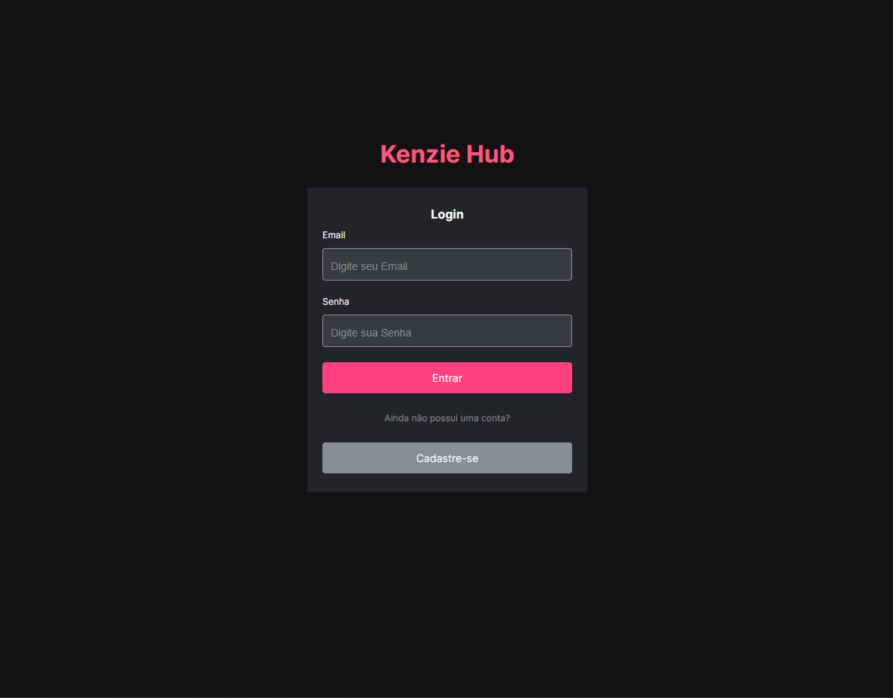

<h1 align="center">
  Kenzie - Hub
</h1>

##  Visão Geral

Principaltecnologias usada.

- [React](https://react.dev/)
- [Zod](https://zod.dev/)
- [React-router](https://reactrouter.com/en/main)
---

  A aplicação foi desenvolvida com o intuito de garantir eficiência, segurança e uma ótima experiência do usuário. A escolha do React para um desenvolvimento mais eficiente e uma experiência de usuário dinâmica.

 A integração do Zod na aplicação ofereceu uma camada robusta de validação para formulários e dados inseridos. Isso não apenas aumenta a segurança, garantindo a integridade dos dados, mas também proporciona uma melhor experiência ao usuário ao evitar entradas inválidas

  A utilização do React Router permitiu a criação de um sistema de navegação eficiente e intuitivo. As rotas foram configuradas de maneira a fornecer uma experiência de usuário fluida, garantindo que os usuários possam navegar pela aplicação de forma lógica e fácil.

